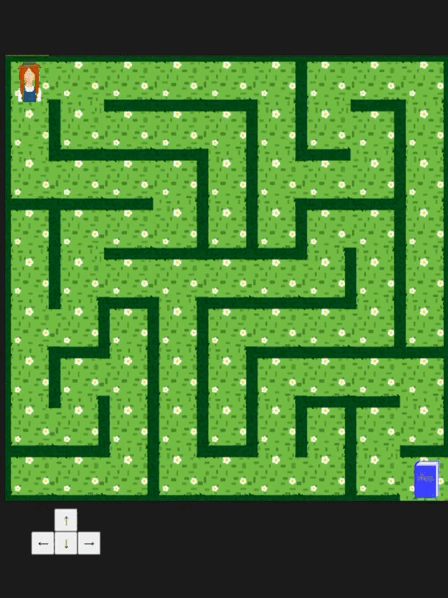
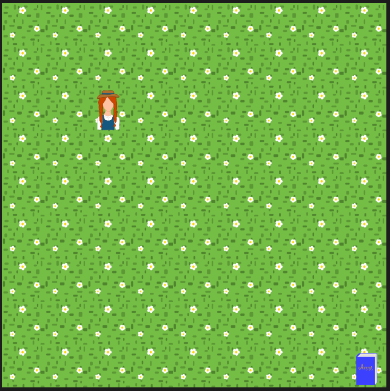
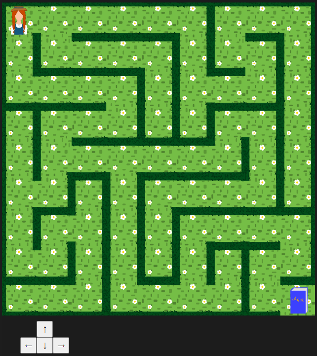

# Jogo de labirinto

Este jogo foi criado a partir do que foi ensinado na aula técnica inaugural do curso de backend da Cubos Academy. Foi usada a biblioteca p5.js e o jogo pode ser acessado pelo link https://editor.p5js.org/nataliasimedo/full/4dvU8mBxK

## O que é p5.js

p5.js é uma biblioteca JavaScript que permite criar jogos e outros projetos de forma simples. É uma ferramenta livre e gratuita que está disponível no site https://p5js.org/ 

## Proposta do jogo

Durante a aula, foi ensinada a construção de um jogo de caça ao tesouro, cujo objetivo é levar a personagem até o objeto no canto da tela usando as setas do teclado.

Fiz algumas alterações para acrescentar obstáculos e transformar o jogo em um labirinto. Os obstáculos impedem que a personagem se movimente livremente como era na versão anterior do jogo.

Também foram acrescentados botões com setas, tornando opcional o uso do teclado. Dessa forma também é possível jogar pelo celular.

## Organização do projeto

O jogo foi criado diretamente no editor do site p5.js. Foi feito o download dos arquivos do projeto e eles se encontram na pasta p5-js. Todo o código criado por mim se encontra no arquivo sketch.js.

Para executar o jogo, acesse o link: https://editor.p5js.org/nataliasimedo/full/4dvU8mBxK
